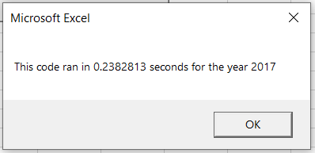

# stock-analysis

## Overview of Project
#### The purpose of this project is to refactor a VBA script in order to more efficiently automate the collection of stock data (total daily volume and return). 

## Results
#### The results of refactoring the VBA script on the 2018 and 2017 stock detail data was as follows:

## Summary
#### A few advantages of refactoring code is that it can be easier to read and the code generally runs faster.  
#### The refactored VBA script ran faster than the original code as noted below:

## Speed of original code run:

## Speed of refactored code:

